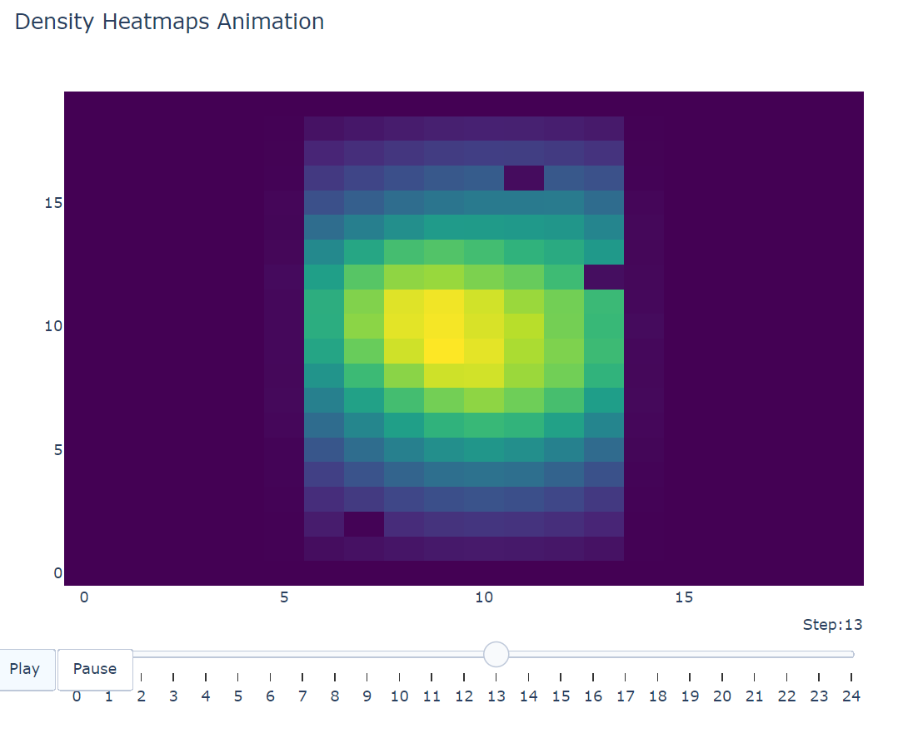

### 3D fluid simulation
linear algebra/physics-based simulation engine for high-performance real-time 3D fluid simulation and volumetric rendering

#### inspired by & based on:
- an investigation I did during my internship @ Oxford Nanopore and a thermodynamics exploration i did for IB Math AA HL
- research & summary done by Mike Ash of Université d'Orléans in Orléans, [Master's Thesis](https://www.mikeash.com/thesis/)
- Jon Stam's paper on the gamification of Fluid Simulation, [Access Paper](https://www.dgp.toronto.edu/public_user/stam/reality/Research/pdf/GDC03.pdf)

this is a C++ adaptation of the versions presented in the resources above.

#### implementation includes (the theory):
- Jacobi method of solving diffusion equation [More Details](https://byjus.com/maths/jacobian-method/)
- Poisson equation for pressure [More Details](https://barbagroup.github.io/essential_skills_RRC/numba/4/)
- Navier Stokes Equations [More Details](https://en.wikipedia.org/wiki/Navier%E2%80%93Stokes_equations)

#### visualization tools:- heatmap.py generates animations of fluid simulations performed _how?_:
1. ```cmake build ```
2. ```cmake --build build ```
3. ```./build/fluid_sim.exe ```
4. ```python visualizers/heatmap.py ```

